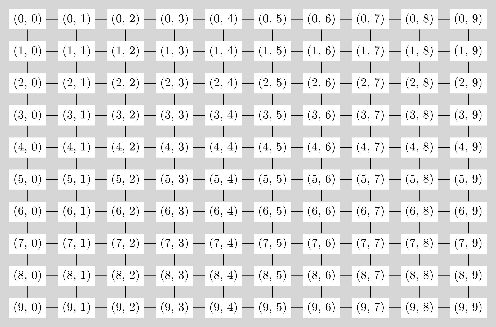

# Δημιουργία Λαβυρίνθων

Γνωρίζουμε ότι αν θέλουμε να διατρέξουμε ένα γράφο μπορούμε να χρησιμοποιήσουμε είτε την κατά βάθος είτε την κατά πλάτος αναζήτηση. Γνωρίζουμε επίσης ότι οι μέθοδοι αυτοί αντιστοιχούν σε τρόπους εξερεύνησης ενός λαβυρίνθου.

Ας δούμε τώρα το αντίστροφο πρόβλημα, με ποιον τρόπο μπορούμε να φτιάξουμε λαβυρίνθους; Ένας τρόπος είναι ο παρακάτω:

Θεωρούμε ότι έχουμε έναν γράφο n x n, δηλαδή με n γραμμές που η κάθε μία τους έχει n κόμβους διατεταγμένους όπως σε ένα καμβά. Οι κόμβοι αντιστοιχούν στα δωμάτια του λαβυρίνθου. Αρχικά θεωρούμε ότι κάθε κόμβος είναι συνδεμένος με όλους τους γειτονικούς του κόμβους. Οι γωνιακοί κόμβοι έχουν δύο γείτονες, οι κόμβοι που βρίσκονται στην περιφέρεια του γράφου αλλά όχι στις γωνίες έχουν τρεις γείτονες και οι εσωτερικοί κόμβοι έχουν τέσσερεις γείτονες. Ένας τέτοιος γράφος είναι ο παρακάτω.



1. Ξεκινάμε από ένα κόμβο του γράφου.

2. Σημειώνουμε ότι έχουμε επισκεφτεί τον κόμβο και παίρνουμε τη λίστα με τα γειτονικούς κόμβους του, δηλαδή τα γειτονικά δωμάτιά του. Παίρνουμε με τυχαία σειρά τα γειτονικά στοιχεία και προχωράμε ως εξής:
  
  * Αν δεν έχουμε επισκευτεί το γειτονικό κόμβο, πηγαίνουμε σε αυτόν τον κόμβο, αποθηκεύουμε το σύνδεσμο μεταξύ των δύο κόμβων και συνεχίζουμε αναδρομικά τη διαδικασία από το βήμα 2 με το γειτονικό στοιχείο.

Στην ουσία δηλαδή κάνουμε μια κατά βάθος αναζήτηση του γράφου όπου σε κάθε κόμβο παίρνουμε τους γειτονικούς του με τυχαία σειρά και αποθηκεύουμε κάπου τους συνδέσμους που ακολουθήσαμε.

Όταν ολοκληρώσουμε τη διαδικασία έχουμε στα χέρια μας ένα νέο γράφο. Οι κορυφές του είναι οι κορυφές του αρχικού γράφου και οι σύνδεσμοι είναι οι σύνδεσμοι που ακολουθήσαμε. Αυτός ο γράφος είναι ένας λαβύρινθος.

Εσείς θα φτιάξετε ένα πρόγραμμα σε γλώσσα Python το οποίο θα κατασκευάζει λαβυρίνθους με αυτή τη διαδικασία. Το πρόγραμμα θα καλείται ως εξής:

```
python make_maze.py <n> <start_x> <start_y> <seed> <output_file>
```

Προσέξτε ότι αντί για `python` στο σύστημά σας μπορεί να πρέπει να δώσετε `python3`.

Το πρόγραμμα λοιπόν παίρνει τέσσερεις παραμέτρους, ως εξής:

* `n` είναι ο αριθμός των γραμμών και των στηλών του πλέγματος του γράφου. Μπορεί να είναι μέχρι και 30. 
*  `start_x` είναι η x συντεταγμένη του κόμβου εκκίνησης, με `0 <= start_x < n`.
*  `start_y` είναι η y συντεταγμένη του κόμβου εκκίνησης, με `0 <= start_y < n`.
*  `seed` είναι ένας αριθμός ή συμβολοσειρά, θα εξηγήσουμε στη συνέχεια.
*  `output_file` είναι το αρχείο στο οποίο θα αποθηκευτεί ο λαβύρινθος.

Για παράδειγμα, ο χρήστης θα μπορεί να δώσει:

```
python make_maze.py 10 5 5 20150206 maze_10x10.txt
```

Το αρχείο στο οποίο θα αποθηκεύεται ο λαβύρινθος θα είναι της μορφής:

```
5, 2), (6, 2)
(6, 2), (6, 1)
(6, 1), (7, 1)
(7, 1), (8, 1)
(8, 1), (8, 0)
(8, 0), (9, 0)
(9, 0), (9, 1)
(9, 1), (9, 2)
(9, 2), (9, 3)
(9, 3), (8, 3)
(8, 3), (8, 2)
...
```

Δηλαδή, θα αποτελείται από γραμμές, κάθε μία από τις οποίες αντιστοιχεί σε ένα σύνδεσμο του γράφου του λαβυρίνθου.

## Απαιτήσεις Προγράμματος

Κάθε φοιτητής θα εργαστεί στο προσωπικό του αποθετήριο στο GitHub. Για να αξιολογηθεί μια εργασία θα πρέπει να πληροί τις παρακάτω προϋποθέσεις:

1. Όλη η εργασία θα πρέπει να βρίσκεται σε έναν κατάλογο `assignment-2015-1` μέσα στο αποθετήριο του φοιτητή.

2. Το πρόγραμμα θα πρέπει να έχει όνομα `make_maze.py`.

3. Το πρόγραμμα θα πρέπει να παράγει στην έξοδό του αρχεία με τη μορφή που έχει προδιαγραφεί.

Παραδείγματα αρχείων εξόδου του προγράμματος είναι τα εξής:

* [maze_10x10.txt](maze_10x10.txt) το οποίο αντιστοιχεί σε ένα [λαβύρινθο 10x10](maze_10x10.pdf).
* [maze_20x20.txt](maze_20x20.txt) το οποίο αντιστοιχεί σε ένα [λαβύρινθο 20x20](maze_20x20.pdf).
* [maze_30x30.txt](maze_20x20.txt) το οποίο αντιστοιχεί σε ένα [λαβύρινθο 30x30](maze_30x30.pdf).

## Παραγωγή Εικόνων Λαβυρίνθων

Αν θέλετε να δείτε τους λαβυρίνθους σε γραφική μορφή, μπορείτε να επισκεφτείτε την ιστοσελίδα [http://snf-638616.vm.okeanos.grnet.gr](http://snf-638616.vm.okeanos.grnet.gr/) όπου ανεβάζοντας το αρχείο που δημιουργείτε θα παίρνετε ζωγραφισμένο το λαβύρινθο σε μορφή PDF. Αν η μορφή του αρχείου που έχετε παράξει είναι λάθος, θα πάρετε αντίστοιχο μήνυμα.

## Παραγωγή Τυχαίας Σειράς

Προκείμενου να επισκεφτείτε τους γείτονες ενός κόμβου με τυχαία σειρά, θα πρέπει να μπορείτε να ανακατέψετε μια λίστα. Αν έχετε μια λίστα `neighbouring_nodes` για να πάρετε τα στοιχεία της σε τυχαία σειρά μπορείτε να χρησιμοποιήσετε τον παρακάτω κώδικα:

```python
random_neighbours = random.sample(neighbouring_nodes, len(neighbouring_nodes))
```

Στην αρχή του προγράμματός σας θα πρέπει να έχετε προσθέσει:

```python
import random

random.seed(input_seed)
```

όπου `input_seed` είναι η τιμή της παραμέτρου `seed` που έδωσε ο χρήστης όταν κάλεσε το πρόγραμμα.

Γιατί το κάνουμε αυτό; Οι υπολογιστές μπορούν να παράγουν τυχαίους αριθμούς με ψευδο-τυχαίους τρόπους, οι οποίοι απαιτούν μια τιμή εκκίνησης. Η τιμή εκκίνησης είναι η τιμή `seed`. Θα δείτε ότι δίνοντας διαφορετικό `seed` παίρνετε διαφορετικούς γράφους.


